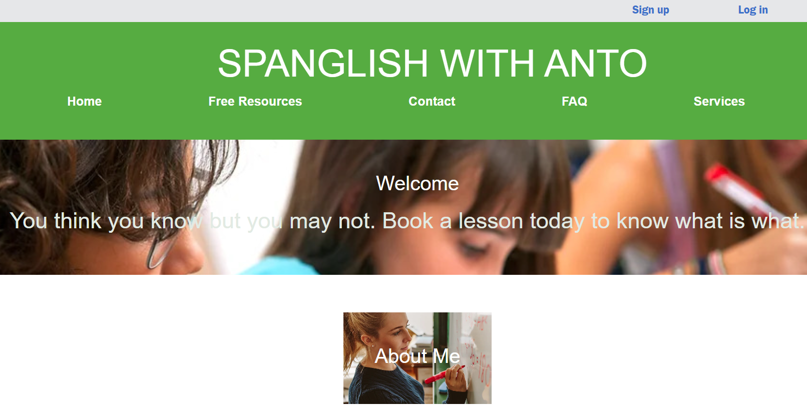

<h1 align="center">Spanglish with Anto 🌐📚💬  </h1>
 
 Welcome to Spanglish with Anto, a language learning platform that combines the beauty of both Spanish and English! 🎉

# Technologies Used 🚀 #
-React JS: For building the dynamic and interactive user interface.
-Node JS: For the server-side logic and handling requests.
-MongoDB: As the database to store user information and services data.
-Bootstrap: For creating a clean and responsive design.

## Functionalities Offered 💡##
User Features:
User Authentication: Securely log in to your account as a user.
-Services Management: Explore available language learning services, add new ones, and delete unwanted ones.
-Payment Integration: Seamlessly make payments for language learning services.
-Redirection to Free Resources: Access free language learning resources to enhance your skills.
-FAQ Section: Get answers to frequently asked questions.
-Admin Features:
Admin Authentication: Log in as an admin with special privileges.
Services Administration: Manage language learning services, add or remove them.
User Management: View and manage user accounts.
Payment Tracking: Keep track of payments and transactions.

## Screenshots 📷
 

 Your language learning journey begins here!

 Explore a variety of language learning services.

How to Use 📖
-Clone this repository.
-Navigate to the project directory.
-Install dependencies using npm install.
-Start the application with npm start.
-Start the backend with nodemon start server.js
Feel free to explore, learn, and enjoy the Spanglish with Anto experience! 🌟🇪🇸🇬🇧

Deployment 🚀
Check out Spanglish with Anto live on ..... !
